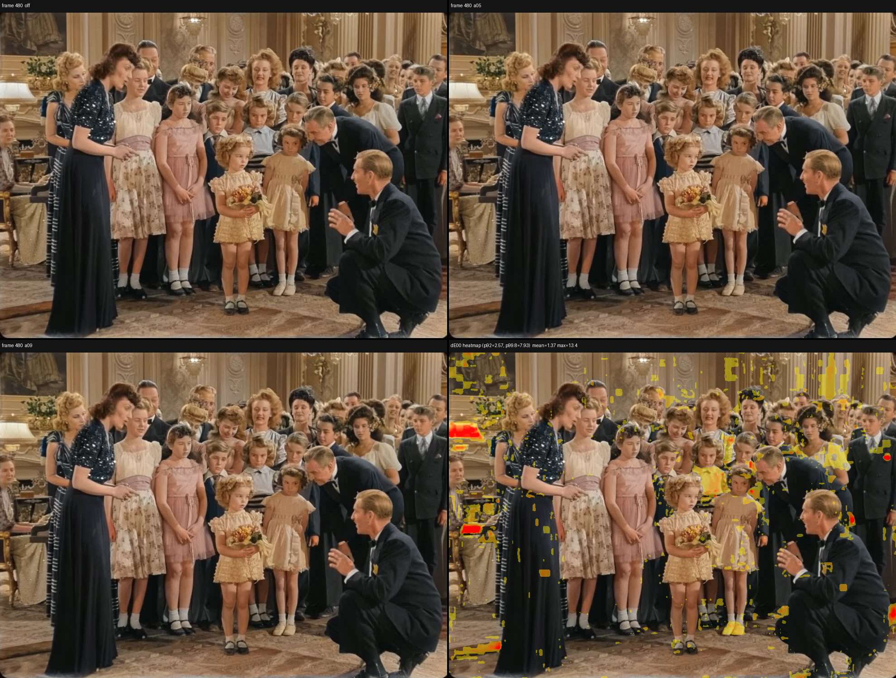
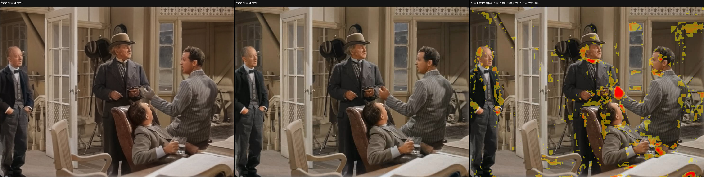

# CMNET2 : Reference-Based Video Colorization

**CMNET2** is a deep-learning system for colorizing grayscale images and videos using colored reference frames. It is built on top of [ColorMNet](https://github.com/yyang181/colormnet) and extends it with an improved three-tier memory architecture inspired by [XMem++](https://github.com/mbzuai-metaverse/XMem2), enabling robust colorization of long videos with hundreds of reference frames.

---

## 📢 What's New

**2026-09-24 — Updated DINOv3 checkpoint (p374099).** Further fine-tuning
(including a learning-rate schedule adjustment past a training plateau)
improves quality over the previous DINOv3 checkpoint
([p372402](https://github.com/dan64/cmnet2/releases/download/v1.2.0/DINOv3FeatureV6_LocalAtten_p372402.pth),
still available for compatibility). Measured on the same 131-clip
validation set (full frames, `--max_side` disabled):

| Metric           | DINOv2 (baseline) | DINOv3 p374099 (current) | Δ                 |
| ---------------- | -----------------:| -------------------------:| -----------------:|
| PSNR             | 37.68 dB          | **38.46 dB**              | +0.77 dB          |
| CIEDE2000 (mean) | 3.36              | **3.01**                  | -0.35 (10% better)|
| CIEDE2000 (p90)  | 7.25              | **6.45**                  | -0.80 (11% better)|

Improves on both metrics on ~93-95% of individual clips (all three
metrics agree on 88.5% of clips), with no systematic weakness on either
natural-content (DAVIS) or archival-film clips. See
[Model Variants](#model-variants) below for the original p369412
comparison.

**2026-09-23 — Added optional proximity-weighted memory matching
(`--enable_proximity_bias`, DINOv3 only).** When several `perm_mem`
reference frames match a frame's content similarly well — the scenario
flagged in the `--window_size` note below, where visually similar but
differently-colored references can get blended toward gray — CMNET2 can
now break ties by favoring temporally closer references, without ever
reducing `perm_mem`'s overall contribution relative to `work_mem`/
`long_mem`. Off by default. See
[Proximity-weighted memory matching](#proximity-weighted-memory-matching-optional-dinov3-only)
for details.

**2026-09-21 — Updated DINOv3 checkpoint (p372402).** Further fine-tuning
improves quality over the previous DINOv3 checkpoint
([p369412](https://github.com/dan64/cmnet2/releases/download/v1.1.0/DINOv3FeatureV6_LocalAtten_p369412.pth),
still available for compatibility). Measured on the same 131-clip
validation set (full frames, `--max_side` disabled):

| Metric           | DINOv2 (baseline) | DINOv3 p372402 (current) | Δ                 |
| ---------------- | -----------------:| -------------------------:| -----------------:|
| PSNR             | 37.68 dB          | **38.29 dB**              | +0.61 dB          |
| CIEDE2000 (mean) | 3.36              | **3.07**                  | -0.29 (9% better) |
| CIEDE2000 (p90)  | 7.25              | **6.58**                  | -0.67 (9% better) |

Improves on both metrics on ~88-92% of individual clips (all three
metrics agree on 83% of clips), with no systematic weakness on either
natural-content (DAVIS) or archival-film clips. See
[Model Variants](#model-variants) below for the original p369412
comparison.

**2026-09-15 — Added DinoV3 backbone.** CMNET2 now supports a fully fine-tuned DINOv3 ViT-B/16
key-encoder backbone as an alternative to the original frozen DINOv2 ViT-S/14, improving both
PSNR and perceptual color accuracy (CIEDE2000). See
[Model Variants](#model-variants) for the full comparison and [Key Features](#key-features)
below for a summary.

---

## Key Features

- **Reference-based colorization** : propagates color from one or more colored reference frames to a grayscale video, operating in the LAB color space for perceptual accuracy.
- **Permanent memory (XMem++ style)** : reference frames are stored in a dedicated `perm_mem` store that is never compressed or evicted, ensuring color fidelity across the entire video.
- **Preloading API** : reference frames can be bulk-loaded into memory before colorization begins, decoupling the reference ingestion phase from the inference phase.
- **Sliding window memory management** : for long videos with thousands of reference frames, a configurable sliding window evicts the oldest references and loads new ones as the video progresses, keeping VRAM usage bounded.
- **Adaptive VRAM management** : gradual memory pressure response: slides 70% of permanent memory when VRAM drops below 500 MB, full reset only as a last resort below 100 MB.
- **DINOv2 + ResNet50 fusion backbone** : multi-scale key features are extracted by fusing DINOv2 ViT-S/14 semantic features with ResNet50 spatial features at 1/4, 1/8, and 1/16 scales.
- **DINOv3 backbone (default, recommended)** : an alternative key-encoder backbone using a fully fine-tuned DINOv3 ViT-B/16 in place of the frozen DINOv2 ViT-S/14, trained end-to-end on the same reference-based colorization loss. Improves both PSNR and perceptual color accuracy (CIEDE2000) across a 131-clip validation set spanning DAVIS and archival B&W film footage (see [Model Variants](#model-variants)).
- **GPU-accelerated LAB→RGB conversion** : `lab2rgb` implemented with exact CIE formulas on GPU via PyTorch, replacing the CPU-bound skimage conversion (-14% total frame time).
- **Chroma transfer pipeline** : optional input resize + YUV chroma transfer for a 3× speedup on full-resolution videos, with no perceptible quality loss.

---

## Requirements

- Python 3.10+
- PyTorch 2.x with CUDA
- CUDA-capable GPU (16 GB VRAM recommended for long videos)

```bash
pip install torch torchvision torchaudio --index-url https://download.pytorch.org/whl/cu121
pip install opencv-python pillow scikit-image tqdm numpy transformers
```

> **Note on `transformers` compatibility:** the DINOv3 backbone's internal
> layer naming changed between `transformers` versions (nested
> `backbone.model.layer.*` in ≥5.x vs flat `backbone.layer.*` in 4.x).
> CMNET2 detects and adapts to either automatically when loading the
> checkpoint — no action needed. Both 4.57.6 and 5.5.4 have been verified
> to load the DINOv3 checkpoint correctly.

---

## Directory Structure

```
cmnet2/
├── weights/
│   ├── DINOv2FeatureV6_LocalAtten_s2_154000.pth   # ColorMNet pre-trained weights (DINOv2 backbone)
│   ├── DINOv3FeatureV6_LocalAtten_p374099.pth     # Fine-tuned weights (DINOv3 backbone, recommended)
│   ├── DINOv3FeatureV6_LocalAtten_p372402.pth     # Previous DINOv3 checkpoint, kept for compatibility
│   ├── DINOv3FeatureV6_LocalAtten_p369412.pth     # Earlier DINOv3 checkpoint, kept for compatibility
│   └── dinov3-vitb16/                              # DINOv3 ViT-B/16 backbone (HuggingFace format)
│
├── models/
│   ├── checkpoints/
│   │   ├── dinov2_vits14_pretrain.pth              # DINOv2 ViT-S/14 backbone weights
│   │   ├── resnet18-5c106cde.pth                   # ResNet18 pre-trained weights
│   │   └── resnet50-19c8e357.pth                   # ResNet50 pre-trained weights
│   │
│   └── facebookresearch_dinov2_main/               # DINOv2 source code (required by torch.hub)
│
├── assets/
│   ├── image/                                      # sample image for test_imge.py
│   ├── video/                                      # sample short video for test_video.py
│   ├── video_full/
│   │   ├── sample_bw_full.mp4                      # sample 5-min B&W clip for test_video_full.py
│   │   └── ref/                                    # colored reference frames
│   ├── video_slide/                                # sample video for test_video_slide.py
│   └── compare/                                    # DINOv2 vs DINOv3 visual comparison (see "Model Variants")
│
├── colormnet/                                      # model source code
│   ├── models.json                                 # checkpoint file names (see "Model file names")
│   └── models_config.py                            # models.json loader (get_cmnet2_model, check_file)
├── test_imge.py                                    # single image colorization
├── test_video.py                                   # video colorization (all refs preloaded)
├── test_video_slide.py                             # video colorization (basic sliding window)
└── test_video_full.py                              # long video with full sliding window pipeline
```

> **Note:** The `weights/` and `models/` directories are not included in the repository.
> Download all required files from the [Releases page](https://github.com/dan64/cmnet2/releases) as described below.

---

## Download Model Weights

Download the following files and place them in the correct directories
(DINOv2 files are on the [v1.0.0 Release](https://github.com/dan64/cmnet2/releases/tag/v1.0.0),
the DINOv3 backbone directory on the [v1.1.0 Release](https://github.com/dan64/cmnet2/releases/tag/v1.1.0),
and the current recommended DINOv3 checkpoint on the
[v1.3.0 Release](https://github.com/dan64/cmnet2/releases/tag/v1.3.0)):

| File                                       | Destination           | Download                                                                                                      |
| ------------------------------------------ | --------------------- | ------------------------------------------------------------------------------------------------------------- |
| `DINOv2FeatureV6_LocalAtten_s2_154000.pth` | `weights/`            | [download](https://github.com/dan64/cmnet2/releases/download/v1.0.0/DINOv2FeatureV6_LocalAtten_s2_154000.pth) |
| `dinov2_vits14_pretrain.pth`               | `models/checkpoints/` | [download](https://github.com/dan64/cmnet2/releases/download/v1.0.0/dinov2_vits14_pretrain.pth)               |
| `resnet18-5c106cde.pth`                    | `models/checkpoints/` | [download](https://github.com/dan64/cmnet2/releases/download/v1.0.0/resnet18-5c106cde.pth)                    |
| `resnet50-19c8e357.pth`                    | `models/checkpoints/` | [download](https://github.com/dan64/cmnet2/releases/download/v1.0.0/resnet50-19c8e357.pth)                    |
| `facebookresearch_dinov2_main.zip`         | extract to `models/`  | [download](https://github.com/dan64/cmnet2/releases/download/v1.0.0/facebookresearch_dinov2_main.zip)         |
| `dinov3-vitb16.zip`                        | extract to `weights/` | [download](https://github.com/dan64/cmnet2/releases/download/v1.1.0/dinov3-vitb16.zip)                        |
| `DINOv3FeatureV6_LocalAtten_p374099.pth`   | `weights/`            | [download](https://github.com/dan64/cmnet2/releases/download/v1.3.0/DINOv3FeatureV6_LocalAtten_p374099.pth)   |
| `DINOv3FeatureV6_LocalAtten_p372402.pth`   | `weights/`            | [download](https://github.com/dan64/cmnet2/releases/download/v1.2.0/DINOv3FeatureV6_LocalAtten_p372402.pth)   |
| `DINOv3FeatureV6_LocalAtten_p369412.pth`   | `weights/`            | [download](https://github.com/dan64/cmnet2/releases/download/v1.1.0/DINOv3FeatureV6_LocalAtten_p369412.pth)   |

> **Note:** `facebookresearch_dinov2_main/` contains the DINOv2 source code required by
> `torch.hub` to instantiate the model. Extract the zip so that the folder is located at
> `models/facebookresearch_dinov2_main/`.

### Model file names (`models.json`)

The names of the checkpoints are not hardcoded in the code: they are stored in a single data
file, `colormnet/models.json`, shipped with the package:

```json
{
  "cmnet2": {
    "dinov3": {
      "checkpoint": "DINOv3FeatureV6_LocalAtten_p374099.pth",
      "weights_dir": "dinov3-vitb16",
      "enable_proximity_bias": false,
      "proximity_bias_alpha": 0.7
    },
    "dinov2": {
      "checkpoint": "DINOv2FeatureV6_LocalAtten_s2_154000.pth"
    }
  }
}
```

Normally there is no need to touch it. Edit it only if the checkpoint files have different names
(custom or renamed weights) or you want to change the default proximity-bias settings:
`checkpoint` is the file inside `weights/`, `weights_dir` is the auxiliary directory used by the
DINOv3 backbone, and `enable_proximity_bias`/`proximity_bias_alpha` set the default for
[proximity-weighted memory matching](#proximity-weighted-memory-matching-optional-dinov3-only)
(DINOv3 only — ignored for DINOv2). When the configured file is missing,
initialization stops immediately and the error lists the files actually present in the weights
directory — so a typo in the checkpoint name (e.g. `LocalAttn` instead of `LocalAtten`) is
immediately visible instead of failing silently.

If `models.json` is missing or malformed, the built-in default names (the ones listed above) are
used, and a warning is logged via the standard `logging` module.

---

## Usage

### Colorize a single image

```bash
python test_imge.py \
  --input  assets/image/image_bw.jpg \
  --ref    assets/image/image_color_ref.jpg \
  --output assets/image/output.jpg
```

### Colorize a video (all references preloaded)

Reference images must be named with the target frame number embedded in the filename
(e.g. `ref_000040.jpg` → applies to frame 40).

```bash
python test_video.py \
  --input    assets/video/sample_bw.mp4 \
  --ref_path assets/video/ref/ \
  --output   assets/video/output.mp4
```

All reference frames are preloaded into `perm_mem` before colorization begins.
The first reference frame is also passed normally at frame 0 to initialize the working memory.

### Colorize a video with basic sliding window (`test_video_slide.py`)

A minimal sliding-window example: fixed `WINDOW_SIZE=6` / `SLIDE_STEP=3` (hardcoded, not
CLI-configurable), no resize, no chroma transfer, no profiling. Useful to read the sliding
window logic without the extra machinery of `test_video_full.py`.

```bash
python test_video_slide.py \
  --input    assets/video_slide/sample_bw.mp4 \
  --ref_path assets/video_slide/ref/ \
  --output   assets/video_slide/output.mp4
```

**Differences from `test_video_full.py`:**

| Aspect                   | `test_video_slide.py`                             | `test_video_full.py`                                |
| ------------------------ | ------------------------------------------------- | --------------------------------------------------- |
| Resize / chroma transfer | none — always full resolution                     | `--max_side` + YUV chroma transfer for speed        |
| Window size              | fixed `WINDOW_SIZE=6`, `SLIDE_STEP=3` (hardcoded) | `--window_size`, auto VRAM-aware mode available     |
| `top_k` / `mem_every`    | fixed at `ColorMNetRender` defaults               | CLI-configurable                                    |
| Profiling                | none                                              | per-phase timing + estimated FPS on first 50 frames |

### Colorize a long video with sliding window (`test_video_full.py`)

The main script for production use. Supports long videos with hundreds of reference frames,
optional input resize with chroma transfer, and automatic VRAM-aware window sizing.

```bash
python test_video_full.py \
  --input       assets/video_full/sample_bw_full.mp4 \
  --ref_path    assets/video_full/ref/ \
  --output      assets/video_full/output.mp4 \
  --max_side    512 \
  --window_size 20
```

> **Choosing `--window_size`:** a wider permanent-memory window is not
> always better. If the window holds many reference frames that look
> visually similar to each other but have different colors — typical with
> sparse reference extraction (≈1 frame/sec or less) on scenes with large,
> uniform-colored surfaces — the top-k memory matching can end up averaging
> conflicting colors instead of picking the right one, washing the result
> toward gray. This shows up mainly when combined with a small `--max_side`
> (less local detail available to tell similar-looking references apart),
> not from either factor alone. As a starting point, `--window_size` between
> 20 and 50 works well for most content; go higher only if your reference
> frames are extracted densely (redundant, not conflicting), or lower
> `--top_k` (e.g. 10-15) if you need to keep a wide window regardless.
> See also
> [proximity-weighted memory matching](#proximity-weighted-memory-matching-optional-dinov3-only)
> below, which targets this same failure mode directly.

**CLI parameters:**

| Parameter       | Default  | Description                                                                         |
| --------------- | -------- | ----------------------------------------------------------------------------------- |
| `--max_side`    | `-1`     | Resize longest side before colorization. `-1` = original resolution.                |
| `--window_size` | `-1`     | Max reference frames in `perm_mem`. `-1` or `0` = auto (fills until 30% VRAM free). |
| `--top_k`       | `30`     | Top-K for memory matching softmax. Lower = faster, less accurate.                   |
| `--mem_every`   | `5`      | Store a colorized frame in working memory every N frames.                           |
| `--backbone`    | `dinov3` | Key encoder backbone: `dinov2` or `dinov3` (see [Model Variants](#model-variants)). |

**Performance profile** on a 960×730 clip with 158 reference frames (RTX 5070 Ti, 16 GB VRAM):

| Mode                              | FPS  | Notes                       |
| --------------------------------- | ---- | --------------------------- |
| Full resolution, no resize        | 2.63 | Best quality                |
| Resize to 512px + chroma transfer | 5.80 | Recommended for long videos |

---

### Proximity-weighted memory matching (optional, DINOv3 only)

By default, `perm_mem` candidates are ranked purely by content similarity — the memory
readout has no notion of *when* in the video a reference frame was captured relative to the
frame being colorized. This is exactly the scenario flagged in the `--window_size` note above:
with a wide window holding several visually similar but differently-colored references, the
top-k match can end up blending frames that shouldn’t be blended equally, washing the result
toward gray.

`--enable_proximity_bias` adds an optional, additive penalty — scaled to the actual spread of
similarity scores among a frame’s surviving top-k candidates, not a fixed constant — that
favors temporally closer `perm_mem` references over farther ones *among otherwise-comparable
candidates*. It never reduces `perm_mem`’s total contribution relative to `work_mem`/`long_mem`:
the aggregate weight `perm_mem` would have received without the bias is preserved exactly —
only redistributed internally, by proximity.

```bash
python test_video_full.py \
  --input       assets/video_full/sample_bw_full.mp4 \
  --ref_path    assets/video_full/ref/ \
  --output      assets/video_full/output.mp4 \
  --enable_proximity_bias \
  --proximity_bias_alpha 0.7
```

| Parameter                 | Default                    | Description                                                                                    |
| -------------------------- | --------------------------- | ------------------------------------------------------------------------------------------------ |
| `--enable_proximity_bias` | off                         | Enable proximity-weighted matching. **DINOv3 only** — silently has no effect on DINOv2.       |
| `--proximity_bias_alpha`  | `0.7` (from `models.json`) | Strength of the temporal-proximity preference, relative to the frame’s own similarity spread. `0` ≈ off; higher values favor the closest reference more strongly. |

Off by default, and configurable per-backbone in `models.json` alongside the checkpoint name
(see [Model file names](#model-file-names-modelsjson)). This is a newer, opt-in feature without
a large-scale quantitative benchmark yet (unlike the DINOv2/DINOv3 comparison above) — worth
trying on content with closely-spaced, visually similar reference frames; less likely to matter
on sparse or well-separated references. To permanently enable it by default (useful for permanent
memory window size > 50) it is necessary to set `enable_proximity_bias=true` in the configuration 
file stored in: colormnet/models.json as shown in the example below:

```json
{
  "cmnet2": {
    "dinov3": {
      "checkpoint": "DINOv3FeatureV6_LocalAtten_p374099.pth",
      "weights_dir": "dinov3-vitb16",
      "enable_proximity_bias": true,
      "proximity_bias_alpha": 0.7
    },
    "dinov2": {
      "checkpoint": "DINOv2FeatureV6_LocalAtten_s2_154000.pth"
    }
  }
}
```

### Visual example



Same frame colorized with the bias off, at `alpha=0.5`, and at `alpha=0.9` (top-left,
top-right, bottom-left), plus a ΔE₀₀ heatmap between the off and `alpha=0.9` outputs
(bottom-right), using the same adaptive-threshold methodology described under
[Visual comparison](#visual-comparison-dinov2-vs-dinov3) above. Most of the frame is
diffuse yellow — the same low-level rendering noise seen between backbones elsewhere in
this README, not a systematic shift. Two red (strongly-differing) regions stand out on the
left: the upper one is just a highlight on a lamp, not meaningful; the lower one is the
seated woman's arm resting near the piano, which shifts from a flat, slightly-off tan
(bias off) to a warmer, more natural skin tone as the bias is enabled — a case where
favoring a closer, better-matching reference measurably improves the result.

---

## Architecture

```
Grayscale input frame (L channel in LAB)
    ↓
KeyEncoder  ←  ResNet50 (1/4, 1/8, 1/16) + DINOv2 ViT-S/14 or DINOv3 ViT-B/16 (fused via Fuse blocks)
    ↓
Key / Shrinkage / Selection tensors
    ↓
MemoryManager : 3-tier memory
    ├── perm_mem   : reference frames, never evicted         ← XMem++ extension
    ├── work_mem   : recent colorized frames (LRU tracking)
    └── long_mem   : compressed prototypes (128 per consolidation)
    ↓
Memory readout (scaled L2 affinity + softmax, top-k=30)
    ↓
ValueEncoder  ←  ResNet18-based, fuses image features + memory readout
    ↓
Decoder (GRU hidden state + upsampling blocks)
    ↓
AB color channels → LAB →[GPU CIE]→ RGB → colorized frame
    ↓ (if --max_side)
Chroma transfer: L from original full-size + UV from colorized resized → final frame
```

### Core classes

| Class                  | File                                    | Description                                                                                                   |
| ---------------------- | --------------------------------------- | ------------------------------------------------------------------------------------------------------------- |
| `ColorMNetRender`      | `colormnet/colormnet_render.py`         | Public API. Singleton. Handles GPU memory, reference management, sliding window.                              |
| `InferenceCore`        | `colormnet/inference/inference_core.py` | Frame-by-frame inference loop. Exposes `step()`, `step_AnyExemplar()`, `load_reference()`.                    |
| `MemoryManager`        | `colormnet/inference/memory_manager.py` | Manages `perm_mem`, `work_mem`, `long_mem`. Handles consolidation and sliding.                                |
| `ColorMNet`            | `colormnet/model/network.py`            | Top-level `nn.Module`.                                                                                        |
| `KeyEncoder_DINOv2_v6` | `colormnet/model/modules.py`            | DINOv2 or DINOv3 + ResNet50 fusion backbone, selected via `backbone` (see [Model Variants](#model-variants)). |

---

## Model Variants

CMNET2 ships with two interchangeable key-encoder backbones:

| Backbone                                                | Weights file                              | Status                                     |
| -------------------------------------------------------- | -------------------------------------------- | --------------------------------------------- |
| DINOv2 ViT-S/14 (frozen)                                  | `DINOv2FeatureV6_LocalAtten_s2_154000.pth`   | Original, kept for backward compatibility  |
| DINOv3 ViT-B/16 (fully fine-tuned)                        | `DINOv3FeatureV6_LocalAtten_p374099.pth`     | **Recommended**                            |
| DINOv3 ViT-B/16 (fully fine-tuned, earlier checkpoint)    | `DINOv3FeatureV6_LocalAtten_p372402.pth`     | Previous release, kept for compatibility   |
| DINOv3 ViT-B/16 (fully fine-tuned, earlier checkpoint)    | `DINOv3FeatureV6_LocalAtten_p369412.pth`     | Earlier release, kept for compatibility    |

The DINOv3 variant was fine-tuned end-to-end (backbone included) on the same reference-based
colorization loss used for the original ColorMNet training, using a mix of DAVIS and archival
B&W film footage. Measured on a 131-clip validation set (full frames, `--max_side` disabled):

> The figures below were measured on the
> [p369412](https://github.com/dan64/cmnet2/releases/download/v1.1.0/DINOv3FeatureV6_LocalAtten_p369412.pth)
> checkpoint. See [What's New](#-whats-new) for the current p372402
> benchmark.

| Metric           | DINOv2 (baseline) | DINOv3 (fine-tuned) | Δ                 |
| ---------------- | -----------------:| -------------------:| -----------------:|
| PSNR             | 37.62 dB          | **38.04 dB**        | +0.42 dB          |
| CIEDE2000 (mean) | 3.36              | **3.18**            | -0.18 (5% better) |
| CIEDE2000 (p90)  | 7.25              | **6.80**            | -0.45 (6% better) |

DINOv3 improves on both metrics on ~80-85% of individual clips, with no systematic weakness
on either natural-content (DAVIS) or archival-film clips.

### Visual comparison (DINOv2 vs DINOv3)

[`assets/compare/`](assets/compare/) contains 54 side-by-side frame comparisons hand-picked from
a full-length archival B&W film test (from [sample_bw_full.mp4](https://github.com/dan64/cmnet2/blob/master/assets/video_full/sample_bw_full.mp4) test clip, 7222 frames, colorized once
with each backbone and sampled every 24 frames / 1 per second). Each image is a triptych —
DINOv2 output | DINOv3 output | a CIEDE2000 (ΔE₀₀) difference heatmap overlaid on the DINOv3
frame:



The heatmap uses a **per-frame adaptive threshold** (92nd/99.8th percentile of that frame's own
ΔE₀₀ distribution, after light denoising) rather than a fixed threshold: the two backbones differ
by a diffuse, fairly uniform low-level amount almost everywhere, so a fixed threshold either lights
up the whole frame or hides real localized differences. The adaptive threshold instead highlights,
in red/orange, only the regions where one backbone diverges from the other *more than the frame's
own baseline* — which is what reliably surfaces genuinely different color choices (e.g. an object
or a hand colorized differently) instead of just generic frame-wide grading noise.

**Conclusion:** across this visual sample, **DINOv3 generally produces more accurate and natural
colors than DINOv2** — consistent with the quantitative PSNR/CIEDE2000 advantage measured above.
The clearest differences show up on skin tones and small foreground objects/details, where DINOv2
more often drifts toward flat, desaturated, or plainly wrong colors (e.g. a gray instead of a
naturally colored hand) that DINOv3 gets right.

---

## Public API

```python
from colormnet.colormnet_render import ColorMNetRender
from PIL import Image

colorizer = ColorMNetRender(
    image_size=-1,          # -1 = original resolution
    vid_length=1000,        # total number of frames to colorize
    max_memory_frames=5000, # long-term memory capacity
    encode_mode=1,          # 0=remote, 1=async, 2=sync
    top_k=30,               # memory matching top-K
    mem_every=5,            # working memory update frequency
    enable_proximity_bias=False, # DINOv3 only, see "Proximity-weighted memory matching"
    proximity_bias_alpha=0.7,    # strength, only used when enabled
    project_dir="."
)

# Option A : preload all references before colorization
for i, ref_img in enumerate(reference_images):
    colorizer.preload_reference(ref_img, frame_idx=i)  # loads into perm_mem;
                                                       # frame_idx (optional) is needed
                                                       # for --enable_proximity_bias to
                                                       # take effect for this reference

colorizer.set_ref_frame(reference_images[0])      # initialize work_mem
frame_colored = colorizer.colorize_frame(ti=0, frame_i=grayscale_frame)

# Option B : pass reference alongside each frame
colorizer.set_ref_frame(ref_img)
frame_colored = colorizer.colorize_frame(ti=i, frame_i=grayscale_frame)

# Sliding window control
count = colorizer.get_perm_mem_frame_count()      # current perm_mem size
colorizer.slide_permanent_memory(n_frames=50)     # evict oldest 50 refs
```

---

## Performance Optimizations

### LAB→RGB conversion on GPU

The original ColorMNet uses `skimage.color.lab2rgb()` on CPU for every output frame.
CMNET2 replaces this with an exact CIE LAB→XYZ→RGB implementation running entirely
on GPU via PyTorch, keeping the tensor on the GPU until the final `detach().cpu()`.
Both implementations are available via the `mode` parameter:

```python
# colormnet/util/transforms.py
lab2rgb_transform_PIL(mask, mode="gpu")  # default : CIE exact on GPU
lab2rgb_transform_PIL(mask, mode="cpu")  # fallback : skimage on CPU
```

This saves ~60ms per frame (-14% total) on a 960×730 input.

### Chroma transfer pipeline (`--max_side`)

When `--max_side` is set, colorization runs at reduced resolution and the color channels
are transferred back to the original frame via YUV chroma transfer:

1. The input frame is downscaled to `max_side` px on the longest side (aspect ratio preserved, even dimensions guaranteed).
2. ColorMNet colorizes the reduced frame.
3. The colorized output is upscaled with LANCZOS4 and its U/V channels are transferred to the original full-resolution frame in YUV space, preserving the original luminance (Y channel) exactly.

This yields a **3× speedup** (1.94 → 5.80 FPS on 960×730) with no perceptible quality loss on the color channels.

### DINOv3 backbone

See [Model Variants](#model-variants) for the full quality comparison.

---

## Differences from the original ColorMNet

| Feature                | Original ColorMNet         | CMNET2                                      |
| ---------------------- | -------------------------- | ------------------------------------------- |
| Memory stores          | working + long-term        | **permanent** + working + long-term         |
| Memory matching         | content similarity only    | content similarity + optional **proximity bias** (temporal distance, DINOv3 only) |
| Reference handling     | passed with each frame     | **preloadable in bulk** before inference    |
| Long video support     | resets memory periodically | **sliding window** over permanent memory    |
| VRAM pressure response | full reset                 | **graduated**: slide 70% → full reset       |
| `reset_on_ref_update`  | active                     | deprecated (permanent memory handles it)    |
| LAB→RGB conversion     | skimage CPU                | **CIE exact on GPU** (-14% frame time)      |
| Full-res output        | always                     | optional **chroma transfer** for 3× speedup |
| Window size            | fixed constant             | **CLI parameter + auto VRAM-aware mode**    |

---

## Credits

CMNET2 is based on:

- **ColorMNet** : [yyang181/colormnet](https://github.com/yyang181/colormnet)
- **XMem** : [hkchengrex/XMem](https://github.com/hkchengrex/XMem)
- **XMem++** : [mbzuai-metaverse/XMem2](https://github.com/mbzuai-metaverse/XMem2)
- **DINOv2** : [facebookresearch/dinov2](https://github.com/facebookresearch/dinov2)
- **DINOv3** : [facebookresearch/dinov3](https://github.com/facebookresearch/dinov3)

---

## Projects Using CMNET2

CMNET2 is used as a core component in the following projects:

- **[HAVCServerDiT](https://github.com/dan64/HAVCServerDiT)** — Hybrid Automatic Video Colorizer (HAVC) server that exposes a GPU-accelerated colorization pipeline for B&W images and video frames based on Diffusion Transformer (DiT) models, with CMNET2 as the exemplar-based backbone.
- **[vs-cmnet2](https://github.com/dan64/vs-cmnet2)** — VapourSynth filter for exemplar-based video colorization using CMNET2.
- **[vs-havc](https://github.com/dan64/vs-havc)** — A Deep Learning based VapourSynth filter for colorizing and restoring old images and video, based on DeOldify, DDColor, ColorMNet/CMNET2 and DeepRemaster.

---

## License

This project inherits the license terms of the original ColorMNet repository.
Please refer to the [original repository](https://github.com/yyang181/colormnet) for details.
